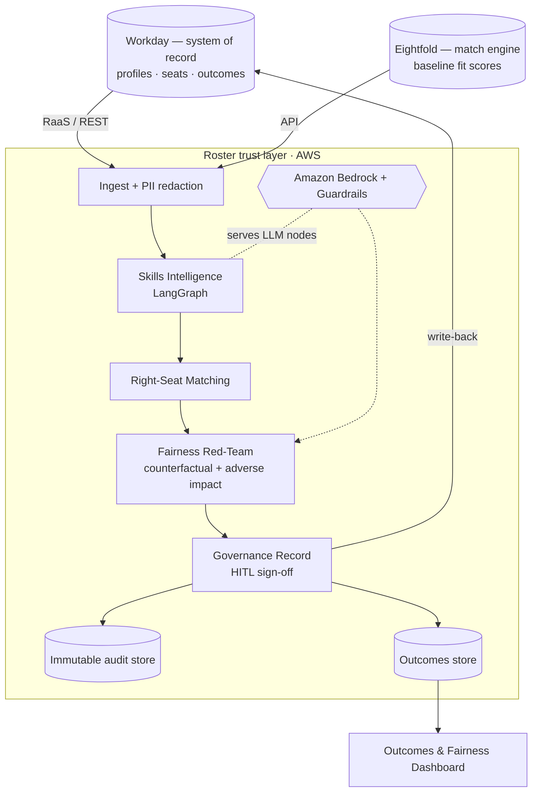

# Roster Implementation Plan

> **For agentic workers:** REQUIRED SUB-SKILL: Use superpowers:subagent-driven-development (recommended) or superpowers:executing-plans to implement this plan task-by-task. Steps use checkbox (`- [ ]`) syntax for tracking.

**Goal:** Build Roster — an evidence-grounded skills + right-seat matching layer with a counterfactual fairness red-team, auditable decision records, and an outcomes dashboard — as `tools/roster/` in the `responsible-talent-ai` monorepo.

**Architecture:** A deterministic, key-free core (skills intelligence → matching → fairness red-team → governance record) wrapped by a LangGraph `StateGraph` orchestrator and a Streamlit UI. Mock `WorkdayClient`/`EightfoldClient` adapters mirror real API shapes and supply seeded synthetic data; the mock Eightfold deliberately encodes a stretch-role age bias that the red-team catches. LLM calls are an optional enhancement behind a deterministic fallback.

**Tech Stack:** Python 3.10+, Streamlit, pandas, numpy, scikit-learn (available but core uses hand-rolled stats), LangGraph; optional provider SDKs (anthropic/openai/google) imported lazily.

## Global Constraints

- Python 3.10+ ; no scipy (stats by hand, per suite convention).
- Runs **key-free and offline**: every LLM call is guarded by `llm.is_configured()` with a deterministic fallback. The app must fully work with no provider key.
- **Synthetic data only.** No real people. Seeded/deterministic via fixed seed.
- Cast numpy results to native Python types (`int`/`float`/`bool`) before asserting or JSON-serializing (numpy `bool_`/`float64` break `is` and `json`).
- Stats implemented by hand (the reused `adverse_impact.py` uses `math.erfc`, no scipy).
- All work under `tools/roster/`. Follow the bias-auditor patterns.
- Every commit message ends with the trailer:
  `Co-Authored-By: Claude Opus 4.8 (1M context) <noreply@anthropic.com>`
- Skill IDs are the canonical join key everywhere. `seat.required_skills` and ontology use skill **IDs**; `worker.self_reported_skills` use human skill **names** (mapped to IDs via the ontology in `reconcile`).

---

## File Structure

```
tools/roster/
├── app.py                      # Streamlit UI + dashboard (manual-verified)
├── src/
│   ├── __init__.py
│   ├── models.py               # dataclasses: Artifact, EvidenceRef, SkillScore, EvidenceProfile, Reconciliation, Match, CounterfactualResult, DecisionRecord
│   ├── ontology.py             # Ontology loader + name/alias → skill_id matching
│   ├── skills_intelligence.py  # extract_and_classify, score_skill, build_profile, reconcile
│   ├── matching.py             # rank_seats + per-seat explanation
│   ├── adverse_impact.py       # COPIED verbatim from bias-auditor (disparate impact)
│   ├── fairness_redteam.py     # make_counterfactual, counterfactual_seat_test, surfaced_table, aggregate_impact
│   ├── governance.py           # build_record, sign_off, record_to_dict
│   ├── graph.py                # LangGraph StateGraph + run_pipeline convenience
│   ├── llm.py                  # COPIED verbatim from bias-auditor (provider-agnostic)
│   └── connectors/
│       ├── __init__.py
│       ├── workday.py          # WorkdayClient (mock, real-API shape)
│       └── eightfold.py        # EightfoldClient (mock; seeded stretch-role age bias)
├── scripts/generate_sample.py  # writes data/*.json deterministically
├── data/                       # ontology.json, workers.json, seats.json, outcomes_history.json
├── tests/                      # pytest, one file per src module
├── requirements.txt  .env.example  README.md  LICENSE
└── docs/architecture.md        # AWS/Bedrock reference diagram (mermaid)
```

---

### Task 1: Scaffold + sample-data generator

**Files:**
- Create: `tools/roster/__init__.py`, `tools/roster/src/__init__.py`, `tools/roster/src/connectors/__init__.py`, `tools/roster/requirements.txt`, `tools/roster/.env.example`, `tools/roster/LICENSE`
- Create: `tools/roster/scripts/generate_sample.py`
- Test: `tools/roster/tests/test_sample_data.py`

**Interfaces:**
- Produces: `data/ontology.json` (list of `{skill_id, name, aliases[]}`), `data/workers.json` (list of worker dicts), `data/seats.json` (list of seat dicts), `data/outcomes_history.json`. Worker dict shape: `{"id","name","current_role","tenure_years","artifacts":[{"id","type","text","date"}],"self_reported_skills":[name,...],"protected":{"gender","age_band","ethnicity"}}`. Seat dict: `{"id","type":"role"|"gig","title","required_skills":[skill_id,...],"stretch":bool}`.

- [ ] **Step 1: Write the failing test**

```python
# tools/roster/tests/test_sample_data.py
import json, subprocess, sys
from pathlib import Path

ROOT = Path(__file__).resolve().parents[1]
DATA = ROOT / "data"

def _gen():
    subprocess.run([sys.executable, str(ROOT / "scripts" / "generate_sample.py")], check=True)

def test_generates_all_fixtures():
    _gen()
    for name in ("ontology.json", "workers.json", "seats.json", "outcomes_history.json"):
        assert (DATA / name).exists(), f"missing {name}"

def test_dataset_is_coherent():
    _gen()
    ont = json.loads((DATA / "ontology.json").read_text())
    seats = json.loads((DATA / "seats.json").read_text())
    workers = json.loads((DATA / "workers.json").read_text())
    skill_ids = {s["skill_id"] for s in ont}
    # every required skill exists in the ontology
    for seat in seats:
        for sid in seat["required_skills"]:
            assert sid in skill_ids, f"{seat['id']} requires unknown {sid}"
    # at least one stretch seat and one worker in the 50+ band (to exercise bias)
    assert any(s["stretch"] for s in seats)
    assert any(w["protected"]["age_band"] == "50+" for w in workers)
    # deterministic: regenerating yields identical bytes
    first = (DATA / "workers.json").read_bytes(); _gen()
    assert (DATA / "workers.json").read_bytes() == first
```

- [ ] **Step 2: Run test to verify it fails**

Run: `cd tools/roster && python -m pytest tests/test_sample_data.py -v`
Expected: FAIL (generator missing / FileNotFoundError).

- [ ] **Step 3: Write the generator**

```python
# tools/roster/scripts/generate_sample.py
"""Deterministically write synthetic Roster fixtures to data/. Seeded; no real people."""
import json, random
from pathlib import Path

DATA = Path(__file__).resolve().parents[1] / "data"
SEED = 42

ONTOLOGY = [
    {"skill_id": "py", "name": "Python", "aliases": ["python", "pytest", "pandas"]},
    {"skill_id": "ml", "name": "Machine Learning", "aliases": ["machine learning", "model", "scikit", "training"]},
    {"skill_id": "llm", "name": "LLM Engineering", "aliases": ["llm", "prompt", "rag", "agent", "langgraph"]},
    {"skill_id": "data", "name": "Data Engineering", "aliases": ["sql", "etl", "pipeline", "warehouse", "dbt"]},
    {"skill_id": "lead", "name": "Technical Leadership", "aliases": ["led", "mentored", "roadmap", "stakeholder"]},
    {"skill_id": "cloud", "name": "Cloud Architecture", "aliases": ["aws", "terraform", "bedrock", "infra"]},
    {"skill_id": "fe", "name": "Frontend", "aliases": ["react", "typescript", "ui", "streamlit"]},
]

def _artifact(i, atype, text, date):
    return {"id": f"a{i}", "type": atype, "text": text, "date": date}

def build():
    rnd = random.Random(SEED)
    workers = []
    # Maria: strong evidence of LLM work she did NOT self-report (hidden strength); age 50+
    workers.append({
        "id": "w-maria", "name": "Maria Alvarez", "current_role": "Data Engineer",
        "tenure_years": 7,
        "artifacts": [
            _artifact(1, "pr", "Built a RAG agent with LangGraph and prompt routing", "2026-05-20"),
            _artifact(2, "commit", "tune retrieval model training loop", "2026-05-02"),
            _artifact(3, "doc", "ETL pipeline + warehouse dbt design", "2026-04-10"),
            _artifact(4, "pr", "Python pandas refactor with pytest", "2026-06-01"),
        ],
        "self_reported_skills": ["Python", "Data Engineering"],  # NOTE: no LLM claim
        "protected": {"gender": "F", "age_band": "50+", "ethnicity": "Hispanic"},
    })
    names = ["Alex Kim","Sam Patel","Jordan Lee","Riley Cohen","Casey Wong","Drew Olsen",
             "Taylor Reed","Jamie Ford","Morgan Diaz","Avery Singh","Pat Nolan"]
    roles = ["Software Engineer","Data Engineer","ML Engineer","Product Analyst"]
    bands = ["20-29","30-39","40-49","50+"]
    skillsets = [["Python","Machine Learning"],["Python","LLM Engineering"],
                 ["Data Engineering","Python"],["Cloud Architecture","Python"],
                 ["Technical Leadership","Python"],["Frontend","Python"]]
    texts = {
        "Python": "python pandas pytest refactor", "Machine Learning": "model training scikit",
        "LLM Engineering": "llm prompt rag agent", "Data Engineering": "sql etl pipeline dbt",
        "Cloud Architecture": "aws terraform bedrock infra", "Technical Leadership": "led mentored roadmap",
        "Frontend": "react typescript ui",
    }
    for i, nm in enumerate(names):
        sset = skillsets[i % len(skillsets)]
        arts = [_artifact(100 + i * 10 + j, ("pr" if j == 0 else "commit"),
                          texts[s], f"2026-0{(i % 5) + 1}-1{j}") for j, s in enumerate(sset)]
        workers.append({
            "id": f"w-{i}", "name": nm, "current_role": roles[i % len(roles)],
            "tenure_years": 2 + (i % 8), "artifacts": arts,
            "self_reported_skills": sset,
            "protected": {"gender": ("F" if i % 2 else "M"),
                          "age_band": bands[i % len(bands)],
                          "ethnicity": ["White","Black","Asian","Hispanic"][i % 4]},
        })

    seats = [
        {"id": "s-llm-lead", "type": "gig", "title": "LLM Platform Lead (stretch)",
         "required_skills": ["llm", "lead", "py"], "stretch": True},
        {"id": "s-ml-stretch", "type": "gig", "title": "ML Tech Lead (stretch)",
         "required_skills": ["ml", "lead", "py"], "stretch": True},
        {"id": "s-data", "type": "role", "title": "Senior Data Engineer",
         "required_skills": ["data", "py"], "stretch": False},
        {"id": "s-cloud", "type": "role", "title": "Cloud Architect",
         "required_skills": ["cloud", "py"], "stretch": False},
        {"id": "s-fe", "type": "role", "title": "Frontend Engineer",
         "required_skills": ["fe", "py"], "stretch": False},
    ]

    # Seeded dashboard history: monthly activity vs outcomes + fairness drift.
    months = ["2026-01","2026-02","2026-03","2026-04","2026-05","2026-06"]
    outcomes = []
    for m in months:
        outcomes.append({
            "month": m,
            "matches_surfaced": 40 + rnd.randint(0, 20),       # activity
            "placements": 6 + rnd.randint(0, 6),               # activity
            "regrettable_attrition_rate": round(0.12 - 0.01 * months.index(m), 3),  # outcome ↓
            "time_to_productivity_days": 70 - 4 * months.index(m),                  # outcome ↓
            "internal_fill_rate": round(0.45 + 0.03 * months.index(m), 3),          # outcome ↑
            "opportunity_impact_ratio": round(0.70 + 0.04 * months.index(m), 3),    # fairness ↑→1.0
            "override_rate": round(0.30 - 0.02 * months.index(m), 3),               # trust
        })
    return ONTOLOGY, workers, seats, outcomes

def main():
    DATA.mkdir(parents=True, exist_ok=True)
    ont, workers, seats, outcomes = build()
    for name, obj in [("ontology.json", ont), ("workers.json", workers),
                      ("seats.json", seats), ("outcomes_history.json", outcomes)]:
        (DATA / name).write_text(json.dumps(obj, indent=2, sort_keys=True) + "\n")

if __name__ == "__main__":
    main()
```

Also create the trivial files:

```python
# tools/roster/__init__.py , tools/roster/src/__init__.py , tools/roster/src/connectors/__init__.py
# (empty files)
```

```text
# tools/roster/requirements.txt
streamlit>=1.33
pandas>=2.0
numpy>=1.24
scikit-learn>=1.3
langgraph>=0.2
# Optional LLM providers (install only what you use):
# anthropic>=0.34
# openai>=1.40
# google-generativeai>=0.7
```

```text
# tools/roster/.env.example
# Optional — Roster runs fully without any of these (deterministic fallback).
# LLM_PROVIDER=anthropic
# ANTHROPIC_API_KEY=
# LLM_PROVIDER=openai
# OPENAI_API_KEY=
# LLM_PROVIDER=gemini
# GOOGLE_API_KEY=
```

Copy the suite MIT `LICENSE` into `tools/roster/LICENSE`:
Run: `cp tools/bias-auditor/LICENSE tools/roster/LICENSE`

- [ ] **Step 4: Run test to verify it passes**

Run: `cd tools/roster && python -m pytest tests/test_sample_data.py -v`
Expected: PASS (3 tests).

- [ ] **Step 5: Commit**

```bash
git add tools/roster
git commit -m "feat(roster): scaffold + deterministic synthetic data generator

Co-Authored-By: Claude Opus 4.8 (1M context) <noreply@anthropic.com>"
```

---

### Task 2: Domain models

**Files:**
- Create: `tools/roster/src/models.py`
- Test: `tools/roster/tests/test_models.py`

**Interfaces:**
- Produces: `Artifact(id,type,text,date)`, `EvidenceRef(artifact_id,artifact_type,snippet)`, `SkillScore(skill_id,name,proficiency,recency_days,evidence,source)`, `EvidenceProfile(worker_id,skills)` with `.skill_ids()->set[str]` and `.get(skill_id)->SkillScore|None`, `Reconciliation(gaps,hidden_strengths)`, `Match(seat_id,title,score,matched,gaps,evidence,baseline_fit)`, `CounterfactualResult(attribute,original_stretch_seats,twin_stretch_seats,treatment_flag)`, `DecisionRecord(worker_id,recommendation,reconciliation,counterfactual,impact_summary,dissent,signoff,caveat)`.

- [ ] **Step 1: Write the failing test**

```python
# tools/roster/tests/test_models.py
from src.models import SkillScore, EvidenceProfile, EvidenceRef

def test_profile_lookup_and_ids():
    s = SkillScore(skill_id="py", name="Python", proficiency=0.6, recency_days=10,
                   evidence=[EvidenceRef("a1", "pr", "python pandas")], source="evidence")
    p = EvidenceProfile(worker_id="w1", skills=[s])
    assert p.skill_ids() == {"py"}
    assert p.get("py").proficiency == 0.6
    assert p.get("missing") is None
```

- [ ] **Step 2: Run test to verify it fails**

Run: `cd tools/roster && python -m pytest tests/test_models.py -v`
Expected: FAIL (ModuleNotFoundError: src.models).

- [ ] **Step 3: Write minimal implementation**

```python
# tools/roster/src/models.py
from __future__ import annotations
from dataclasses import dataclass, field

@dataclass(frozen=True)
class Artifact:
    id: str
    type: str            # commit | pr | doc | ticket
    text: str
    date: str            # ISO YYYY-MM-DD

@dataclass(frozen=True)
class EvidenceRef:
    artifact_id: str
    artifact_type: str
    snippet: str

@dataclass
class SkillScore:
    skill_id: str
    name: str
    proficiency: float       # 0..1
    recency_days: int
    evidence: list[EvidenceRef] = field(default_factory=list)
    source: str = "evidence"  # evidence | self

@dataclass
class EvidenceProfile:
    worker_id: str
    skills: list[SkillScore] = field(default_factory=list)

    def skill_ids(self) -> set[str]:
        return {s.skill_id for s in self.skills}

    def get(self, skill_id: str) -> SkillScore | None:
        return next((s for s in self.skills if s.skill_id == skill_id), None)

@dataclass
class Reconciliation:
    gaps: list[str] = field(default_factory=list)             # claimed, no evidence (names)
    hidden_strengths: list[str] = field(default_factory=list) # evidence, never claimed (names)

@dataclass
class Match:
    seat_id: str
    title: str
    score: float
    matched: list[str]                # skill names present
    gaps: list[str]                   # required skill names missing
    evidence: list[EvidenceRef] = field(default_factory=list)
    baseline_fit: float | None = None

@dataclass
class CounterfactualResult:
    attribute: str
    original_stretch_seats: list[str]
    twin_stretch_seats: list[str]
    treatment_flag: bool

@dataclass
class DecisionRecord:
    worker_id: str
    recommendation: list[Match]
    reconciliation: Reconciliation
    counterfactual: CounterfactualResult
    impact_summary: dict
    dissent: list[str] = field(default_factory=list)
    signoff: dict | None = None
    caveat: str = ("Screening aid — not legal advice and not a compliance "
                   "certification. Flags are triggers for human review.")
```

- [ ] **Step 4: Run test to verify it passes**

Run: `cd tools/roster && python -m pytest tests/test_models.py -v`
Expected: PASS.

- [ ] **Step 5: Commit**

```bash
git add tools/roster/src/models.py tools/roster/tests/test_models.py
git commit -m "feat(roster): domain models

Co-Authored-By: Claude Opus 4.8 (1M context) <noreply@anthropic.com>"
```

---

### Task 3: Ontology

**Files:**
- Create: `tools/roster/src/ontology.py`
- Test: `tools/roster/tests/test_ontology.py`

**Interfaces:**
- Consumes: `data/ontology.json` from Task 1.
- Produces: `Ontology` with `Ontology.load(path)->Ontology`, `.match_text(text)->set[str]` (skill_ids whose name/alias appears, case-insensitive, word-boundary), `.name(skill_id)->str`, `.id_for_name(name)->str|None` (exact name or alias match).

- [ ] **Step 1: Write the failing test**

```python
# tools/roster/tests/test_ontology.py
from pathlib import Path
from src.ontology import Ontology

ONT = Path(__file__).resolve().parents[1] / "data" / "ontology.json"

def test_match_text_finds_aliases():
    o = Ontology.load(ONT)
    ids = o.match_text("Built a RAG agent with LangGraph and pandas")
    assert "llm" in ids        # rag/agent/langgraph
    assert "py" in ids         # pandas
    assert "cloud" not in ids

def test_name_and_id_for_name():
    o = Ontology.load(ONT)
    assert o.name("py") == "Python"
    assert o.id_for_name("Python") == "py"
    assert o.id_for_name("python") == "py"   # alias, case-insensitive
    assert o.id_for_name("Underwater Basket Weaving") is None
```

- [ ] **Step 2: Run test to verify it fails**

Run: `cd tools/roster && python -m pytest tests/test_ontology.py -v`
Expected: FAIL (ModuleNotFoundError).

- [ ] **Step 3: Write minimal implementation**

```python
# tools/roster/src/ontology.py
from __future__ import annotations
import json, re
from dataclasses import dataclass
from pathlib import Path

@dataclass(frozen=True)
class OntologySkill:
    skill_id: str
    name: str
    aliases: tuple[str, ...]

class Ontology:
    def __init__(self, skills: list[OntologySkill]):
        self._skills = skills
        self._by_id = {s.skill_id: s for s in skills}

    @classmethod
    def load(cls, path) -> "Ontology":
        raw = json.loads(Path(path).read_text())
        return cls([OntologySkill(s["skill_id"], s["name"], tuple(s["aliases"])) for s in raw])

    def name(self, skill_id: str) -> str:
        return self._by_id[skill_id].name

    def match_text(self, text: str) -> set[str]:
        low = text.lower()
        hits = set()
        for s in self._skills:
            for term in (s.name, *s.aliases):
                if re.search(rf"\b{re.escape(term.lower())}\b", low):
                    hits.add(s.skill_id)
                    break
        return hits

    def id_for_name(self, name: str) -> str | None:
        low = name.strip().lower()
        for s in self._skills:
            if s.name.lower() == low or low in (a.lower() for a in s.aliases):
                return s.skill_id
        return None
```

- [ ] **Step 4: Run test to verify it passes**

Run: `cd tools/roster && python -m pytest tests/test_ontology.py -v`
Expected: PASS.

- [ ] **Step 5: Commit**

```bash
git add tools/roster/src/ontology.py tools/roster/tests/test_ontology.py
git commit -m "feat(roster): skills ontology with alias matching

Co-Authored-By: Claude Opus 4.8 (1M context) <noreply@anthropic.com>"
```

---

### Task 4: Skills Intelligence — build evidence-grounded profile

**Files:**
- Create: `tools/roster/src/skills_intelligence.py`
- Test: `tools/roster/tests/test_skills_intelligence.py`

**Interfaces:**
- Consumes: `Ontology` (Task 3), models (Task 2), worker dict (Task 1).
- Produces: `TYPE_WEIGHTS: dict[str,float]`, `extract_and_classify(artifacts, ontology)->dict[str,list[EvidenceRef]]`, `score_skill(skill_id, refs, ontology, today)->SkillScore`, `build_profile(worker, ontology, today)->EvidenceProfile`. `today` is a `datetime.date`.

- [ ] **Step 1: Write the failing test**

```python
# tools/roster/tests/test_skills_intelligence.py
from datetime import date
from pathlib import Path
from src.ontology import Ontology
import src.skills_intelligence as si

ONT = Ontology.load(Path(__file__).resolve().parents[1] / "data" / "ontology.json")

WORKER = {
    "id": "w-test", "name": "Test", "current_role": "Eng", "tenure_years": 3,
    "artifacts": [
        {"id": "a1", "type": "pr", "text": "Built a RAG agent with LangGraph", "date": "2026-06-01"},
        {"id": "a2", "type": "commit", "text": "python pandas refactor", "date": "2026-05-01"},
    ],
    "self_reported_skills": ["Python"],
    "protected": {"gender": "F", "age_band": "50+", "ethnicity": "Hispanic"},
}

def test_extract_links_evidence_to_skills():
    refs = si.extract_and_classify(WORKER["artifacts"], ONT)
    assert "llm" in refs and refs["llm"][0].artifact_id == "a1"
    assert "py" in refs

def test_build_profile_scores_and_recency():
    p = si.build_profile(WORKER, ONT, today=date(2026, 6, 11))
    llm = p.get("llm")
    assert llm is not None
    assert 0.0 < llm.proficiency <= 1.0
    assert llm.recency_days == 10           # 2026-06-11 minus 2026-06-01
    assert llm.evidence[0].artifact_type == "pr"

def test_proficiency_uses_type_weight():
    # one PR (0.4) should score higher than one commit (0.2)
    refs_pr = si.extract_and_classify([{"id":"x","type":"pr","text":"python","date":"2026-06-01"}], ONT)
    refs_co = si.extract_and_classify([{"id":"y","type":"commit","text":"python","date":"2026-06-01"}], ONT)
    s_pr = si.score_skill("py", refs_pr["py"], ONT, today=date(2026,6,2))
    s_co = si.score_skill("py", refs_co["py"], ONT, today=date(2026,6,2))
    assert s_pr.proficiency > s_co.proficiency
```

- [ ] **Step 2: Run test to verify it fails**

Run: `cd tools/roster && python -m pytest tests/test_skills_intelligence.py -v`
Expected: FAIL (ModuleNotFoundError).

- [ ] **Step 3: Write minimal implementation**

```python
# tools/roster/src/skills_intelligence.py
from __future__ import annotations
from datetime import date
from .models import EvidenceRef, SkillScore, EvidenceProfile
from .ontology import Ontology

TYPE_WEIGHTS = {"pr": 0.4, "doc": 0.25, "commit": 0.2, "ticket": 0.15}

def extract_and_classify(artifacts: list[dict], ontology: Ontology) -> dict[str, list[EvidenceRef]]:
    out: dict[str, list[EvidenceRef]] = {}
    for art in artifacts:
        for sid in ontology.match_text(art["text"]):
            out.setdefault(sid, []).append(
                EvidenceRef(artifact_id=art["id"], artifact_type=art["type"],
                            snippet=art["text"][:120]))
    return out

def score_skill(skill_id: str, refs: list[EvidenceRef], ontology: Ontology, today: date) -> SkillScore:
    proficiency = min(1.0, round(sum(TYPE_WEIGHTS.get(r.artifact_type, 0.1) for r in refs), 4))
    # recency_days computed by build_profile (needs artifact dates); default 0 here
    return SkillScore(skill_id=skill_id, name=ontology.name(skill_id),
                      proficiency=proficiency, recency_days=0, evidence=list(refs),
                      source="evidence")

def build_profile(worker: dict, ontology: Ontology, today: date) -> EvidenceProfile:
    by_skill = extract_and_classify(worker["artifacts"], ontology)
    date_by_art = {a["id"]: date.fromisoformat(a["date"]) for a in worker["artifacts"]}
    skills: list[SkillScore] = []
    for sid, refs in by_skill.items():
        s = score_skill(sid, refs, ontology, today)
        recents = [date_by_art[r.artifact_id] for r in refs]
        s.recency_days = (today - max(recents)).days
        skills.append(s)
    skills.sort(key=lambda s: (-s.proficiency, s.recency_days))
    return EvidenceProfile(worker_id=worker["id"], skills=skills)
```

- [ ] **Step 4: Run test to verify it passes**

Run: `cd tools/roster && python -m pytest tests/test_skills_intelligence.py -v`
Expected: PASS (3 tests).

- [ ] **Step 5: Commit**

```bash
git add tools/roster/src/skills_intelligence.py tools/roster/tests/test_skills_intelligence.py
git commit -m "feat(roster): evidence-grounded skill profiling

Co-Authored-By: Claude Opus 4.8 (1M context) <noreply@anthropic.com>"
```

---

### Task 5: Skills Intelligence — reconcile (gaps + hidden strengths)

**Files:**
- Modify: `tools/roster/src/skills_intelligence.py`
- Test: `tools/roster/tests/test_skills_intelligence.py` (add)

**Interfaces:**
- Produces: `reconcile(profile, self_reported_names, ontology)->Reconciliation`. `gaps` = self-reported skills with no evidence (names); `hidden_strengths` = evidenced skills never self-reported (names).

- [ ] **Step 1: Write the failing test**

```python
# add to tools/roster/tests/test_skills_intelligence.py
from src.models import Reconciliation

def test_reconcile_flags_hidden_strength_and_gap():
    p = si.build_profile(WORKER, ONT, today=date(2026, 6, 11))   # evidences py + llm
    rec = si.reconcile(p, WORKER["self_reported_skills"], ONT)   # self-reported: Python only
    assert "LLM Engineering" in rec.hidden_strengths   # evidenced, never claimed
    assert "Python" not in rec.gaps                    # claimed AND evidenced
```

- [ ] **Step 2: Run test to verify it fails**

Run: `cd tools/roster && python -m pytest tests/test_skills_intelligence.py::test_reconcile_flags_hidden_strength_and_gap -v`
Expected: FAIL (AttributeError: module has no attribute 'reconcile').

- [ ] **Step 3: Write minimal implementation**

```python
# append to tools/roster/src/skills_intelligence.py
from .models import Reconciliation

def reconcile(profile, self_reported_names: list[str], ontology: Ontology) -> Reconciliation:
    claimed_ids = {ontology.id_for_name(n) for n in self_reported_names}
    claimed_ids.discard(None)
    evidenced_ids = profile.skill_ids()
    gaps = sorted(ontology.name(i) for i in claimed_ids - evidenced_ids)
    hidden = sorted(ontology.name(i) for i in evidenced_ids - claimed_ids)
    return Reconciliation(gaps=gaps, hidden_strengths=hidden)
```

- [ ] **Step 4: Run test to verify it passes**

Run: `cd tools/roster && python -m pytest tests/test_skills_intelligence.py -v`
Expected: PASS (4 tests).

- [ ] **Step 5: Commit**

```bash
git add tools/roster/src/skills_intelligence.py tools/roster/tests/test_skills_intelligence.py
git commit -m "feat(roster): reconcile evidence vs self-reported skills

Co-Authored-By: Claude Opus 4.8 (1M context) <noreply@anthropic.com>"
```

---

### Task 6: Mock WorkdayClient connector

**Files:**
- Create: `tools/roster/src/connectors/workday.py`
- Test: `tools/roster/tests/test_workday.py`

**Interfaces:**
- Produces: `WorkdayClient(data_dir)` with `.list_workers()->list[dict]`, `.get_worker(worker_id)->dict`, `.list_open_seats()->list[dict]`, `.get_outcomes()->list[dict]`, `.write_decision_record(record_dict)->str` (returns a synthetic id; mock no-op). Method names mirror Workday Web Services (`Get_Workers`, `Get_Job_Requisitions`).

- [ ] **Step 1: Write the failing test**

```python
# tools/roster/tests/test_workday.py
from pathlib import Path
from src.connectors.workday import WorkdayClient

DATA = Path(__file__).resolve().parents[1] / "data"

def test_workday_reads_fixtures():
    wd = WorkdayClient(DATA)
    assert any(w["id"] == "w-maria" for w in wd.list_workers())
    assert wd.get_worker("w-maria")["current_role"] == "Data Engineer"
    assert any(s["stretch"] for s in wd.list_open_seats())

def test_write_decision_record_returns_id():
    wd = WorkdayClient(DATA)
    rid = wd.write_decision_record({"worker_id": "w-maria"})
    assert isinstance(rid, str) and rid.startswith("REC-")
```

- [ ] **Step 2: Run test to verify it fails**

Run: `cd tools/roster && python -m pytest tests/test_workday.py -v`
Expected: FAIL (ModuleNotFoundError).

- [ ] **Step 3: Write minimal implementation**

```python
# tools/roster/src/connectors/workday.py
"""Mock WorkdayClient. Method shapes mirror Workday Web Services / RaaS.
Swap the JSON reads for real Get_Workers / Get_Job_Requisitions calls to go live."""
from __future__ import annotations
import json
from pathlib import Path

class WorkdayClient:
    def __init__(self, data_dir):
        self._dir = Path(data_dir)

    def _load(self, name):
        return json.loads((self._dir / name).read_text())

    def list_workers(self) -> list[dict]:           # ~ Get_Workers
        return self._load("workers.json")

    def get_worker(self, worker_id: str) -> dict:
        return next(w for w in self.list_workers() if w["id"] == worker_id)

    def list_open_seats(self) -> list[dict]:        # ~ Get_Job_Requisitions (+ gigs)
        return self._load("seats.json")

    def get_outcomes(self) -> list[dict]:           # ~ RaaS report rows
        return self._load("outcomes_history.json")

    def write_decision_record(self, record_dict: dict) -> str:  # ~ Put_* (mock no-op)
        return f"REC-{abs(hash(record_dict.get('worker_id', ''))) % 100000:05d}"
```

- [ ] **Step 4: Run test to verify it passes**

Run: `cd tools/roster && python -m pytest tests/test_workday.py -v`
Expected: PASS.

- [ ] **Step 5: Commit**

```bash
git add tools/roster/src/connectors/workday.py tools/roster/tests/test_workday.py
git commit -m "feat(roster): mock Workday connector (real-API shape)

Co-Authored-By: Claude Opus 4.8 (1M context) <noreply@anthropic.com>"
```

---

### Task 7: Mock EightfoldClient connector (with seeded stretch-role age bias)

**Files:**
- Create: `tools/roster/src/connectors/eightfold.py`
- Test: `tools/roster/tests/test_eightfold.py`

**Interfaces:**
- Consumes: `Ontology` (Task 3), seats (Task 1).
- Produces: `EightfoldClient(seats, ontology, stretch_age_penalty=0.5, biased_band="50+")` with `.score(worker_dict)->list[dict]` (each `{"seat_id","fit_score"}`) and `.get_matching_seats(worker_id, workers)->list[dict]`. Eightfold infers skills from **self-reported** names only (claims, not evidence — this is the gap Roster fixes), then applies a stretch-role penalty for `biased_band` (the bias Roster's red-team catches).

- [ ] **Step 1: Write the failing test**

```python
# tools/roster/tests/test_eightfold.py
from pathlib import Path
from src.ontology import Ontology
from src.connectors.eightfold import EightfoldClient

ROOT = Path(__file__).resolve().parents[1]
ONT = Ontology.load(ROOT / "data" / "ontology.json")
import json
SEATS = json.loads((ROOT / "data" / "seats.json").read_text())

def _worker(band):
    return {"id": "w", "name": "X", "self_reported_skills": ["LLM Engineering", "Technical Leadership", "Python"],
            "protected": {"age_band": band}}

def test_eightfold_penalizes_stretch_for_biased_band():
    ef = EightfoldClient(SEATS, ONT)
    young = {s["seat_id"]: s["fit_score"] for s in ef.score(_worker("30-39"))}
    older = {s["seat_id"]: s["fit_score"] for s in ef.score(_worker("50+"))}
    # identical claimed skills; only the protected band differs
    assert young["s-llm-lead"] > older["s-llm-lead"]      # stretch seat penalized
    assert young["s-data"] == older["s-data"]             # non-stretch seat unaffected
```

- [ ] **Step 2: Run test to verify it fails**

Run: `cd tools/roster && python -m pytest tests/test_eightfold.py -v`
Expected: FAIL (ModuleNotFoundError).

- [ ] **Step 3: Write minimal implementation**

```python
# tools/roster/src/connectors/eightfold.py
"""Mock EightfoldClient. Infers skills from CLAIMED (self-reported) data only and
applies a deliberate stretch-role age penalty — the vendor black-box behaviour that
Roster's evidence layer (claims gap) and fairness red-team (treatment) expose."""
from __future__ import annotations
from .. ontology import Ontology

class EightfoldClient:
    def __init__(self, seats: list[dict], ontology: Ontology,
                 stretch_age_penalty: float = 0.5, biased_band: str = "50+"):
        self._seats = seats
        self._ont = ontology
        self._penalty = stretch_age_penalty
        self._biased_band = biased_band

    def _claimed_ids(self, worker: dict) -> set[str]:
        ids = {self._ont.id_for_name(n) for n in worker.get("self_reported_skills", [])}
        ids.discard(None)
        return ids

    def score(self, worker: dict) -> list[dict]:
        claimed = self._claimed_ids(worker)
        band = worker.get("protected", {}).get("age_band")
        out = []
        for seat in self._seats:
            req = set(seat["required_skills"])
            fit = len(req & claimed) / len(req) if req else 0.0
            if seat["stretch"] and band == self._biased_band:
                fit *= self._penalty
            out.append({"seat_id": seat["id"], "fit_score": round(fit, 4)})
        return out

    def get_matching_seats(self, worker_id: str, workers: list[dict]) -> list[dict]:
        w = next(w for w in workers if w["id"] == worker_id)
        return self.score(w)
```

- [ ] **Step 4: Run test to verify it passes**

Run: `cd tools/roster && python -m pytest tests/test_eightfold.py -v`
Expected: PASS.

- [ ] **Step 5: Commit**

```bash
git add tools/roster/src/connectors/eightfold.py tools/roster/tests/test_eightfold.py
git commit -m "feat(roster): mock Eightfold connector with seeded stretch-role age bias

Co-Authored-By: Claude Opus 4.8 (1M context) <noreply@anthropic.com>"
```

---

### Task 8: Right-Seat Matching

**Files:**
- Create: `tools/roster/src/matching.py`
- Test: `tools/roster/tests/test_matching.py`

**Interfaces:**
- Consumes: `EvidenceProfile` (Task 2/4), seats (Task 1), `Ontology`, optional baseline `dict[seat_id,float]`.
- Produces: `rank_seats(profile, seats, ontology, baseline=None)->list[Match]`, sorted by score desc. Score = `0.6*coverage + 0.4*baseline_fit` when baseline given, else `coverage`. `coverage = sum(proficiency of required skills present)/len(required)`.

- [ ] **Step 1: Write the failing test**

```python
# tools/roster/tests/test_matching.py
from datetime import date
from pathlib import Path
import json
from src.ontology import Ontology
import src.skills_intelligence as si
from src.matching import rank_seats

ROOT = Path(__file__).resolve().parents[1]
ONT = Ontology.load(ROOT / "data" / "ontology.json")
SEATS = json.loads((ROOT / "data" / "seats.json").read_text())
WORKERS = json.loads((ROOT / "data" / "workers.json").read_text())
MARIA = next(w for w in WORKERS if w["id"] == "w-maria")

def test_rank_surfaces_evidence_based_match_with_explanation():
    p = si.build_profile(MARIA, ONT, today=date(2026, 6, 11))
    ranked = rank_seats(p, SEATS, ONT)
    top = ranked[0]
    assert top.score >= ranked[-1].score          # sorted desc
    # Maria has evidence of LLM + Python -> the LLM stretch seat should score and explain
    llm_seat = next(m for m in ranked if m.seat_id == "s-llm-lead")
    assert "LLM Engineering" in llm_seat.matched
    assert llm_seat.evidence                       # carries provenance

def test_baseline_blended_when_provided():
    p = si.build_profile(MARIA, ONT, today=date(2026, 6, 11))
    base = {"s-data": 1.0}
    blended = {m.seat_id: m.score for m in rank_seats(p, SEATS, ONT, baseline=base)}
    nobl = {m.seat_id: m.score for m in rank_seats(p, SEATS, ONT)}
    assert blended["s-data"] != nobl["s-data"]
```

- [ ] **Step 2: Run test to verify it fails**

Run: `cd tools/roster && python -m pytest tests/test_matching.py -v`
Expected: FAIL (ModuleNotFoundError).

- [ ] **Step 3: Write minimal implementation**

```python
# tools/roster/src/matching.py
from __future__ import annotations
from .models import Match
from .ontology import Ontology

def rank_seats(profile, seats: list[dict], ontology: Ontology,
               baseline: dict | None = None) -> list[Match]:
    have = profile.skill_ids()
    out: list[Match] = []
    for seat in seats:
        req = list(seat["required_skills"])
        present = [sid for sid in req if sid in have]
        missing = [sid for sid in req if sid not in have]
        coverage = (sum(profile.get(sid).proficiency for sid in present) / len(req)) if req else 0.0
        bfit = None if baseline is None else float(baseline.get(seat["id"], 0.0))
        score = coverage if bfit is None else (0.6 * coverage + 0.4 * bfit)
        evidence = [ref for sid in present for ref in profile.get(sid).evidence]
        out.append(Match(
            seat_id=seat["id"], title=seat["title"], score=round(float(score), 4),
            matched=[ontology.name(sid) for sid in present],
            gaps=[ontology.name(sid) for sid in missing],
            evidence=evidence[:5], baseline_fit=bfit))
    out.sort(key=lambda m: m.score, reverse=True)
    return out
```

- [ ] **Step 4: Run test to verify it passes**

Run: `cd tools/roster && python -m pytest tests/test_matching.py -v`
Expected: PASS.

- [ ] **Step 5: Commit**

```bash
git add tools/roster/src/matching.py tools/roster/tests/test_matching.py
git commit -m "feat(roster): right-seat matching with evidence-backed explanations

Co-Authored-By: Claude Opus 4.8 (1M context) <noreply@anthropic.com>"
```

---

### Task 9: Reuse adverse_impact + Roster surfacing wrapper

**Files:**
- Create: `tools/roster/src/adverse_impact.py` (copy)
- Create: `tools/roster/src/fairness_redteam.py` (impact half)
- Test: `tools/roster/tests/test_fairness_impact.py`

**Interfaces:**
- Consumes: `EightfoldClient.score` (Task 7), `adverse_impact.analyze_attribute(df, attribute, outcome_col)->AttributeResult`.
- Produces: `surfaced_table(workers, eightfold, threshold=0.5)->pandas.DataFrame` (one row/worker: `gender,age_band,ethnicity,surfaced_stretch`), `aggregate_impact(workers, eightfold, attribute, threshold=0.5)->AttributeResult`.

- [ ] **Step 1: Copy the reused module**

Run: `cp tools/bias-auditor/src/adverse_impact.py tools/roster/src/adverse_impact.py`
(The bias-auditor's own tests already cover its math; we add Roster-usage tests below.)

- [ ] **Step 2: Write the failing test**

```python
# tools/roster/tests/test_fairness_impact.py
from pathlib import Path
import json
from src.ontology import Ontology
from src.connectors.eightfold import EightfoldClient
from src.fairness_redteam import surfaced_table, aggregate_impact

ROOT = Path(__file__).resolve().parents[1]
ONT = Ontology.load(ROOT / "data" / "ontology.json")
SEATS = json.loads((ROOT / "data" / "seats.json").read_text())
WORKERS = json.loads((ROOT / "data" / "workers.json").read_text())

def test_surfaced_table_has_one_row_per_worker():
    ef = EightfoldClient(SEATS, ONT)
    df = surfaced_table(WORKERS, ef)
    assert len(df) == len(WORKERS)
    assert set(["age_band", "surfaced_stretch"]).issubset(df.columns)

def test_aggregate_impact_runs_four_fifths():
    ef = EightfoldClient(SEATS, ONT)
    res = aggregate_impact(WORKERS, ef, attribute="age_band")
    # AttributeResult exposes groups + any_flag (native bool)
    assert isinstance(res.any_flag, bool)
    assert any(g.group == "50+" for g in res.groups)
```

- [ ] **Step 3: Run test to verify it fails**

Run: `cd tools/roster && python -m pytest tests/test_fairness_impact.py -v`
Expected: FAIL (ModuleNotFoundError: src.fairness_redteam).

- [ ] **Step 4: Write minimal implementation**

```python
# tools/roster/src/fairness_redteam.py  (impact half — counterfactual added in Task 10)
from __future__ import annotations
import pandas as pd
from . import adverse_impact

def _stretch_seat_ids(eightfold) -> set[str]:
    return {s["seat_id"] for s in eightfold._seats if s["stretch"]}

def surfaced_table(workers: list[dict], eightfold, threshold: float = 0.5) -> pd.DataFrame:
    stretch = _stretch_seat_ids(eightfold)
    rows = []
    for w in workers:
        scores = {s["seat_id"]: s["fit_score"] for s in eightfold.score(w)}
        surfaced = any(scores.get(sid, 0.0) >= threshold for sid in stretch)
        p = w["protected"]
        rows.append({"worker_id": w["id"], "gender": p["gender"], "age_band": p["age_band"],
                     "ethnicity": p["ethnicity"], "surfaced_stretch": int(surfaced)})
    return pd.DataFrame(rows)

def aggregate_impact(workers: list[dict], eightfold, attribute: str = "age_band",
                     threshold: float = 0.5):
    df = surfaced_table(workers, eightfold, threshold)
    return adverse_impact.analyze_attribute(df, attribute, "surfaced_stretch")
```

- [ ] **Step 5: Run test to verify it passes**

Run: `cd tools/roster && python -m pytest tests/test_fairness_impact.py -v`
Expected: PASS.

- [ ] **Step 6: Commit**

```bash
git add tools/roster/src/adverse_impact.py tools/roster/src/fairness_redteam.py tools/roster/tests/test_fairness_impact.py
git commit -m "feat(roster): reuse adverse-impact for opportunity-surfacing fairness

Co-Authored-By: Claude Opus 4.8 (1M context) <noreply@anthropic.com>"
```

---

### Task 10: Counterfactual red-team (disparate treatment)

**Files:**
- Modify: `tools/roster/src/fairness_redteam.py`
- Test: `tools/roster/tests/test_fairness_counterfactual.py`

**Interfaces:**
- Produces: `make_counterfactual(worker, flips)->dict` (deep-copied twin with `protected` keys overwritten by `flips` and `name` suffixed `" (CF)"`; artifacts + self_reported unchanged), `counterfactual_seat_test(worker, eightfold, flips, threshold=0.5)->CounterfactualResult` comparing the set of stretch seats surfaced for worker vs. twin.

- [ ] **Step 1: Write the failing test**

```python
# tools/roster/tests/test_fairness_counterfactual.py
from pathlib import Path
import json
from src.ontology import Ontology
from src.connectors.eightfold import EightfoldClient
from src.fairness_redteam import make_counterfactual, counterfactual_seat_test

ROOT = Path(__file__).resolve().parents[1]
ONT = Ontology.load(ROOT / "data" / "ontology.json")
SEATS = json.loads((ROOT / "data" / "seats.json").read_text())
WORKERS = json.loads((ROOT / "data" / "workers.json").read_text())
MARIA = next(w for w in WORKERS if w["id"] == "w-maria")  # age_band 50+

def test_make_counterfactual_only_flips_protected():
    twin = make_counterfactual(MARIA, {"age_band": "30-39"})
    assert twin["protected"]["age_band"] == "30-39"
    assert twin["self_reported_skills"] == MARIA["self_reported_skills"]   # qualifications held constant
    assert twin["artifacts"] == MARIA["artifacts"]
    assert MARIA["protected"]["age_band"] == "50+"   # original untouched

def test_counterfactual_detects_treatment_flip():
    ef = EightfoldClient(SEATS, ONT)
    res = counterfactual_seat_test(MARIA, ef, {"age_band": "30-39"})
    # flipping age off the biased band re-surfaces a stretch seat -> treatment flag
    assert res.treatment_flag is True
    assert set(res.twin_stretch_seats) != set(res.original_stretch_seats)
```

- [ ] **Step 2: Run test to verify it fails**

Run: `cd tools/roster && python -m pytest tests/test_fairness_counterfactual.py -v`
Expected: FAIL (ImportError: make_counterfactual).

- [ ] **Step 3: Write minimal implementation**

```python
# append to tools/roster/src/fairness_redteam.py
import copy
from .models import CounterfactualResult

def make_counterfactual(worker: dict, flips: dict) -> dict:
    twin = copy.deepcopy(worker)
    twin["protected"].update(flips)
    twin["name"] = f"{worker['name']} (CF)"
    twin["id"] = f"{worker['id']}-cf"
    return twin

def _surfaced_stretch(worker, eightfold, threshold):
    stretch = _stretch_seat_ids(eightfold)
    scores = {s["seat_id"]: s["fit_score"] for s in eightfold.score(worker)}
    return sorted(sid for sid in stretch if scores.get(sid, 0.0) >= threshold)

def counterfactual_seat_test(worker, eightfold, flips: dict, threshold: float = 0.5) -> CounterfactualResult:
    original = _surfaced_stretch(worker, eightfold, threshold)
    twin = make_counterfactual(worker, flips)
    twin_seats = _surfaced_stretch(twin, eightfold, threshold)
    attr = next(iter(flips))
    return CounterfactualResult(attribute=attr, original_stretch_seats=original,
                                twin_stretch_seats=twin_seats,
                                treatment_flag=set(original) != set(twin_seats))
```

- [ ] **Step 4: Run test to verify it passes**

Run: `cd tools/roster && python -m pytest tests/test_fairness_counterfactual.py -v`
Expected: PASS.

- [ ] **Step 5: Commit**

```bash
git add tools/roster/src/fairness_redteam.py tools/roster/tests/test_fairness_counterfactual.py
git commit -m "feat(roster): counterfactual red-team for disparate treatment

Co-Authored-By: Claude Opus 4.8 (1M context) <noreply@anthropic.com>"
```

---

### Task 11: Governance record + sign-off

**Files:**
- Create: `tools/roster/src/governance.py`
- Test: `tools/roster/tests/test_governance.py`

**Interfaces:**
- Consumes: `Match`, `Reconciliation`, `CounterfactualResult`, `AttributeResult`.
- Produces: `build_record(worker_id, recommendation, reconciliation, counterfactual, impact)->DecisionRecord` (auto-populates `dissent` from flags), `sign_off(record, by, decision)->DecisionRecord`, `record_to_dict(record)->dict` (fully JSON-serializable, native types).

- [ ] **Step 1: Write the failing test**

```python
# tools/roster/tests/test_governance.py
import json
from pathlib import Path
from src.ontology import Ontology
from src.connectors.eightfold import EightfoldClient
from src.fairness_redteam import counterfactual_seat_test, aggregate_impact
from src.models import Match, Reconciliation
from src.governance import build_record, sign_off, record_to_dict

ROOT = Path(__file__).resolve().parents[1]
ONT = Ontology.load(ROOT / "data" / "ontology.json")
SEATS = json.loads((ROOT / "data" / "seats.json").read_text())
WORKERS = json.loads((ROOT / "data" / "workers.json").read_text())
MARIA = next(w for w in WORKERS if w["id"] == "w-maria")

def _record():
    ef = EightfoldClient(SEATS, ONT)
    cf = counterfactual_seat_test(MARIA, ef, {"age_band": "30-39"})
    imp = aggregate_impact(WORKERS, ef, "age_band")
    rec = build_record("w-maria",
                       [Match("s-data", "Senior Data Engineer", 0.8, ["Python"], [], [], None)],
                       Reconciliation(gaps=[], hidden_strengths=["LLM Engineering"]),
                       cf, imp)
    return rec

def test_treatment_flag_records_dissent():
    rec = _record()
    assert any("treatment" in d.lower() for d in rec.dissent)

def test_signoff_and_serialization():
    rec = sign_off(_record(), by="Hiring Manager", decision="approved_with_review")
    d = record_to_dict(rec)
    assert d["signoff"]["by"] == "Hiring Manager"
    json.dumps(d)   # must not raise (native types only)
```

- [ ] **Step 2: Run test to verify it fails**

Run: `cd tools/roster && python -m pytest tests/test_governance.py -v`
Expected: FAIL (ModuleNotFoundError).

- [ ] **Step 3: Write minimal implementation**

```python
# tools/roster/src/governance.py
from __future__ import annotations
from dataclasses import asdict
from .models import DecisionRecord

def build_record(worker_id, recommendation, reconciliation, counterfactual, impact) -> DecisionRecord:
    dissent: list[str] = []
    if counterfactual.treatment_flag:
        dissent.append(f"Disparate treatment: flipping {counterfactual.attribute} changed surfaced "
                       f"stretch seats {counterfactual.original_stretch_seats} -> "
                       f"{counterfactual.twin_stretch_seats}.")
    if bool(impact.any_flag):
        dissent.append("Disparate impact: a group falls below the four-fifths surfacing threshold.")
    impact_summary = {
        "attribute": impact.attribute, "reference_group": impact.reference_group,
        "any_flag": bool(impact.any_flag), "any_significant_flag": bool(impact.any_significant_flag),
        "groups": [{"group": g.group, "n": int(g.n), "selection_rate": round(float(g.selection_rate), 4),
                    "impact_ratio": round(float(g.impact_ratio), 4),
                    "four_fifths_flag": bool(g.four_fifths_flag)} for g in impact.groups],
    }
    return DecisionRecord(worker_id=worker_id, recommendation=recommendation,
                          reconciliation=reconciliation, counterfactual=counterfactual,
                          impact_summary=impact_summary, dissent=dissent)

def sign_off(record: DecisionRecord, by: str, decision: str) -> DecisionRecord:
    record.signoff = {"by": by, "decision": decision}
    return record

def record_to_dict(record: DecisionRecord) -> dict:
    d = asdict(record)   # dataclasses -> nested dicts/lists of native types
    return d
```

- [ ] **Step 4: Run test to verify it passes**

Run: `cd tools/roster && python -m pytest tests/test_governance.py -v`
Expected: PASS.

- [ ] **Step 5: Commit**

```bash
git add tools/roster/src/governance.py tools/roster/tests/test_governance.py
git commit -m "feat(roster): auditable governance record with sign-off

Co-Authored-By: Claude Opus 4.8 (1M context) <noreply@anthropic.com>"
```

---

### Task 12: LangGraph orchestration + run_pipeline

**Files:**
- Create: `tools/roster/src/graph.py`
- Test: `tools/roster/tests/test_graph.py`

**Interfaces:**
- Consumes: all prior src modules + connectors.
- Produces: `run_pipeline(worker_id, workday, eightfold, ontology, today, flips=None)->DecisionRecord`. Internally builds a LangGraph `StateGraph` with nodes profile→match→fairness→govern over a `TypedDict` state, compiles once, and invokes it. `flips` defaults to `{"age_band": "30-39"}`.

- [ ] **Step 1: Write the failing test**

```python
# tools/roster/tests/test_graph.py
from datetime import date
from pathlib import Path
from src.ontology import Ontology
from src.connectors.workday import WorkdayClient
from src.connectors.eightfold import EightfoldClient
from src.graph import run_pipeline
from src.models import DecisionRecord

ROOT = Path(__file__).resolve().parents[1]
DATA = ROOT / "data"
ONT = Ontology.load(DATA / "ontology.json")

def test_pipeline_end_to_end_produces_record():
    wd = WorkdayClient(DATA)
    ef = EightfoldClient(wd.list_open_seats(), ONT)
    rec = run_pipeline("w-maria", wd, ef, ONT, today=date(2026, 6, 11))
    assert isinstance(rec, DecisionRecord)
    assert rec.recommendation                      # ranked seats present
    assert rec.reconciliation.hidden_strengths     # Maria's hidden LLM strength surfaced
    assert rec.counterfactual.treatment_flag is True
```

- [ ] **Step 2: Run test to verify it fails**

Run: `cd tools/roster && python -m pytest tests/test_graph.py -v`
Expected: FAIL (ModuleNotFoundError).

- [ ] **Step 3: Write minimal implementation**

```python
# tools/roster/src/graph.py
"""LangGraph StateGraph wiring the deterministic Roster core into one pipeline.
The shared state IS the accumulating decision record."""
from __future__ import annotations
from datetime import date
from typing import TypedDict
from langgraph.graph import StateGraph, START, END

from . import skills_intelligence as si
from .matching import rank_seats
from .fairness_redteam import counterfactual_seat_test, aggregate_impact
from .governance import build_record

class RosterState(TypedDict, total=False):
    worker_id: str
    worker: dict
    today: object
    flips: dict
    profile: object
    reconciliation: object
    recommendation: list
    counterfactual: object
    impact: object
    record: object
    _ctx: dict   # carries non-serialized clients/ontology/seats/workers

def _profile_node(state: RosterState) -> dict:
    ctx = state["_ctx"]
    w = state["worker"]
    profile = si.build_profile(w, ctx["ontology"], state["today"])
    rec = si.reconcile(profile, w["self_reported_skills"], ctx["ontology"])
    return {"profile": profile, "reconciliation": rec}

def _match_node(state: RosterState) -> dict:
    ctx = state["_ctx"]
    baseline = {s["seat_id"]: s["fit_score"] for s in ctx["eightfold"].score(state["worker"])}
    return {"recommendation": rank_seats(state["profile"], ctx["seats"], ctx["ontology"], baseline)}

def _fairness_node(state: RosterState) -> dict:
    ctx = state["_ctx"]
    cf = counterfactual_seat_test(state["worker"], ctx["eightfold"], state["flips"])
    imp = aggregate_impact(ctx["workers"], ctx["eightfold"], next(iter(state["flips"])))
    return {"counterfactual": cf, "impact": imp}

def _govern_node(state: RosterState) -> dict:
    return {"record": build_record(state["worker_id"], state["recommendation"],
                                   state["reconciliation"], state["counterfactual"], state["impact"])}

def _build_graph():
    g = StateGraph(RosterState)
    g.add_node("profile", _profile_node)
    g.add_node("match", _match_node)
    g.add_node("fairness", _fairness_node)
    g.add_node("govern", _govern_node)
    g.add_edge(START, "profile")
    g.add_edge("profile", "match")
    g.add_edge("match", "fairness")
    g.add_edge("fairness", "govern")
    g.add_edge("govern", END)
    return g.compile()

_GRAPH = _build_graph()

def run_pipeline(worker_id, workday, eightfold, ontology, today: date, flips: dict | None = None):
    worker = workday.get_worker(worker_id)
    ctx = {"ontology": ontology, "eightfold": eightfold, "seats": workday.list_open_seats(),
           "workers": workday.list_workers()}
    state = _GRAPH.invoke({"worker_id": worker_id, "worker": worker, "today": today,
                           "flips": flips or {"age_band": "30-39"}, "_ctx": ctx})
    return state["record"]
```

- [ ] **Step 4: Run test to verify it passes**

Run: `cd tools/roster && python -m pytest tests/test_graph.py -v`
Expected: PASS.

- [ ] **Step 5: Commit**

```bash
git add tools/roster/src/graph.py tools/roster/tests/test_graph.py
git commit -m "feat(roster): LangGraph pipeline orchestration

Co-Authored-By: Claude Opus 4.8 (1M context) <noreply@anthropic.com>"
```

---

### Task 13: Provider-agnostic LLM + optional explanation polish

**Files:**
- Create: `tools/roster/src/llm.py` (copy)
- Create: `tools/roster/src/narrative.py`
- Test: `tools/roster/tests/test_narrative.py`

**Interfaces:**
- Produces: `explain_match(match, worker_name)->str`. Deterministic sentence always; if `llm.is_configured()`, an LLM polish is attempted and falls back to deterministic text on any error. Never raises, never requires a key.

- [ ] **Step 1: Copy the reused client**

Run: `cp tools/bias-auditor/src/llm.py tools/roster/src/llm.py`

- [ ] **Step 2: Write the failing test**

```python
# tools/roster/tests/test_narrative.py
from src.models import Match
from src.narrative import explain_match

def test_explanation_is_deterministic_without_key(monkeypatch):
    monkeypatch.delenv("LLM_PROVIDER", raising=False)
    m = Match("s-llm-lead", "LLM Platform Lead (stretch)", 0.82,
              ["LLM Engineering", "Python"], ["Technical Leadership"], [], 0.4)
    text = explain_match(m, "Maria Alvarez")
    assert "LLM Platform Lead" in text
    assert "Technical Leadership" in text      # names the gap
    assert isinstance(text, str) and len(text) > 0
```

- [ ] **Step 3: Run test to verify it fails**

Run: `cd tools/roster && python -m pytest tests/test_narrative.py -v`
Expected: FAIL (ModuleNotFoundError: src.narrative).

- [ ] **Step 4: Write minimal implementation**

```python
# tools/roster/src/narrative.py
from __future__ import annotations
from .models import Match
from . import llm

def _deterministic(match: Match, worker_name: str) -> str:
    matched = ", ".join(match.matched) or "no evidenced skills"
    gaps = ", ".join(match.gaps) or "none"
    return (f"{worker_name} fits {match.title} at {match.score:.0%} "
            f"(evidence: {matched}; gaps: {gaps}).")

def explain_match(match: Match, worker_name: str) -> str:
    base = _deterministic(match, worker_name)
    if not llm.is_configured():
        return base
    try:
        polished = llm.complete(
            system="Rewrite the talent-match explanation in one crisp, neutral sentence. "
                   "Keep every skill name. No new claims.",
            prompt=base, max_tokens=120, temperature=0.2)
        return polished or base
    except Exception:
        return base
```

- [ ] **Step 5: Run test to verify it passes**

Run: `cd tools/roster && python -m pytest tests/test_narrative.py -v`
Expected: PASS.

- [ ] **Step 6: Commit**

```bash
git add tools/roster/src/llm.py tools/roster/src/narrative.py tools/roster/tests/test_narrative.py
git commit -m "feat(roster): optional LLM explanation polish with deterministic fallback

Co-Authored-By: Claude Opus 4.8 (1M context) <noreply@anthropic.com>"
```

---

### Task 14: Streamlit app — profile, seats, fairness, governance

**Files:**
- Create: `tools/roster/app.py`
- Test: manual (Streamlit UI)

**Interfaces:**
- Consumes: `run_pipeline`, connectors, `explain_match`, `governance.record_to_dict`, `llm.status`.

- [ ] **Step 1: Write the app**

```python
# tools/roster/app.py
from datetime import date
from pathlib import Path
import streamlit as st

from src.ontology import Ontology
from src.connectors.workday import WorkdayClient
from src.connectors.eightfold import EightfoldClient
from src.graph import run_pipeline
from src.narrative import explain_match
from src.governance import sign_off, record_to_dict
from src import llm

DATA = Path(__file__).resolve().parent / "data"
TODAY = date(2026, 6, 11)

st.set_page_config(page_title="Roster", layout="wide")
wd = WorkdayClient(DATA)
ont = Ontology.load(DATA / "ontology.json")
ef = EightfoldClient(wd.list_open_seats(), ont)

st.title("Roster — right people, right seats, proven")
st.caption(f"Trust layer over Workday + Eightfold (mock). {llm.status()}")

page = st.sidebar.radio("View", ["Decision", "Outcomes dashboard"])
if page == "Decision":
    workers = wd.list_workers()
    wid = st.sidebar.selectbox("Worker", [w["id"] for w in workers],
                               format_func=lambda i: wd.get_worker(i)["name"])
    rec = run_pipeline(wid, wd, ef, ont, today=TODAY)

    st.subheader("Evidence-grounded skills")
    if rec.reconciliation.hidden_strengths:
        st.success("Hidden strengths (evidenced, never self-reported): "
                   + ", ".join(rec.reconciliation.hidden_strengths))
    if rec.reconciliation.gaps:
        st.warning("Claimed but unevidenced: " + ", ".join(rec.reconciliation.gaps))

    st.subheader("Right-seat ranking")
    for m in rec.recommendation:
        st.markdown(f"**{m.title}** — fit {m.score:.0%}")
        st.caption(explain_match(m, wd.get_worker(wid)["name"]))

    st.subheader("Fairness red-team")
    cf = rec.counterfactual
    if cf.treatment_flag:
        st.error(f"⚠ Disparate treatment on `{cf.attribute}`: surfaced stretch seats changed "
                 f"{cf.original_stretch_seats} → {cf.twin_stretch_seats} when only the protected "
                 f"attribute was flipped.")
    else:
        st.success("No treatment flip detected on the tested attribute.")
    st.write("Aggregate impact (four-fifths on stretch-seat surfacing):")
    st.json(rec.impact_summary)

    st.subheader("Governance record")
    for d in rec.dissent:
        st.write("• " + d)
    with st.form("signoff"):
        by = st.text_input("Reviewer", "Hiring Manager")
        decision = st.selectbox("Decision", ["approved", "approved_with_review", "rejected"])
        if st.form_submit_button("Sign off"):
            rec = sign_off(rec, by, decision)
            st.success(f"Signed off by {by}: {decision}")
    st.download_button("Download audit record (JSON)",
                       data=__import__("json").dumps(record_to_dict(rec), indent=2),
                       file_name=f"roster_record_{wid}.json")
    st.caption(rec.caveat)
```

- [ ] **Step 2: Manual verification**

Run: `cd tools/roster && python scripts/generate_sample.py && streamlit run app.py`
Expected: app loads; selecting **Maria Alvarez** shows a green "Hidden strengths: LLM Engineering" banner, a ranked seat list, a red disparate-treatment banner on `age_band`, the impact JSON, dissent lines, and a working sign-off + JSON download.

- [ ] **Step 3: Commit**

```bash
git add tools/roster/app.py
git commit -m "feat(roster): Streamlit decision view (profile, seats, fairness, governance)

Co-Authored-By: Claude Opus 4.8 (1M context) <noreply@anthropic.com>"
```

---

### Task 15: Outcomes & fairness dashboard

**Files:**
- Modify: `tools/roster/app.py` (the `Outcomes dashboard` branch)
- Test: manual

**Interfaces:**
- Consumes: `WorkdayClient.get_outcomes()` (Task 6 / Task 1 history).

- [ ] **Step 1: Add the dashboard branch**

```python
# append to tools/roster/app.py (inside the `else:` for page == "Outcomes dashboard")
else:
    import pandas as pd
    df = pd.DataFrame(wd.get_outcomes()).set_index("month")
    st.subheader("Outcomes, not activity")
    c1, c2, c3 = st.columns(3)
    c1.metric("Regrettable attrition", f"{df['regrettable_attrition_rate'].iloc[-1]:.0%}",
              delta=f"{(df['regrettable_attrition_rate'].iloc[-1]-df['regrettable_attrition_rate'].iloc[0]):.0%}")
    c2.metric("Time-to-productivity (days)", int(df['time_to_productivity_days'].iloc[-1]),
              delta=int(df['time_to_productivity_days'].iloc[-1]-df['time_to_productivity_days'].iloc[0]))
    c3.metric("Internal-fill rate", f"{df['internal_fill_rate'].iloc[-1]:.0%}",
              delta=f"{(df['internal_fill_rate'].iloc[-1]-df['internal_fill_rate'].iloc[0]):.0%}")

    st.markdown("**Activity (context, not the goal)**")
    st.bar_chart(df[["matches_surfaced", "placements"]])
    st.markdown("**Outcome trends**")
    st.line_chart(df[["regrettable_attrition_rate", "internal_fill_rate"]])
    st.markdown("**Fairness drift — opportunity impact ratio (target ≥ 0.80)**")
    st.line_chart(df[["opportunity_impact_ratio"]])
    st.markdown("**Trust — human override rate**")
    st.line_chart(df[["override_rate"]])
```

- [ ] **Step 2: Manual verification**

Run: `cd tools/roster && streamlit run app.py` → choose "Outcomes dashboard".
Expected: three outcome metrics with deltas, an activity bar chart, and outcome/fairness/trust line charts trending as seeded (attrition ↓, fill ↑, impact ratio ↑ toward 0.80+).

- [ ] **Step 3: Commit**

```bash
git add tools/roster/app.py
git commit -m "feat(roster): outcomes & fairness-drift dashboard

Co-Authored-By: Claude Opus 4.8 (1M context) <noreply@anthropic.com>"
```

---

### Task 16: README + AWS/Bedrock reference architecture + suite README

**Files:**
- Create: `tools/roster/README.md`, `tools/roster/docs/architecture.md`
- Modify: `README.md` (suite root — add Roster)
- Test: `tools/roster/tests/test_smoke.py` (full suite green + import smoke)

**Interfaces:** none (docs + smoke).

- [ ] **Step 1: Write the smoke test**

```python
# tools/roster/tests/test_smoke.py
import importlib

def test_core_modules_import():
    for m in ["src.models", "src.ontology", "src.skills_intelligence", "src.matching",
              "src.fairness_redteam", "src.governance", "src.graph", "src.narrative",
              "src.connectors.workday", "src.connectors.eightfold"]:
        importlib.import_module(m)
```

- [ ] **Step 2: Run the full Roster suite**

Run: `cd tools/roster && python scripts/generate_sample.py && python -m pytest -q`
Expected: all tests pass (Tasks 1–13 + smoke).

- [ ] **Step 3: Write `tools/roster/docs/architecture.md`**

````markdown
# Roster — Reference Architecture (AWS)

Roster is a trust-and-measurement layer over the talent platforms an org already
owns. The demo runs locally on mock adapters; production targets AWS.



**Security/governance controls:** PII redaction at ingest; Bedrock Guardrails for
prompt-injection/abuse; immutable audit store; human-in-the-loop sign-off;
explainability on every score; synthetic data only in this build.
````

- [ ] **Step 4: Write `tools/roster/README.md`**

```markdown
# Roster

**Roster grounds skills in verifiable evidence, then matches people to the right
seats — fairly, auditably, and measured by outcomes.** It is a trust layer that
sits on top of Workday + Eightfold (mocked here), not a replacement for them.

## Why
Skills graphs run on self-reported or claim-inferred data with no evidence trail.
Roster builds evidence-grounded skill profiles (with provenance), surfaces hidden
strengths, matches to seats, red-teams the matching for disparate treatment and
impact, records an auditable decision, and measures outcomes — not activity.

## Run (no API key needed)
```bash
cd tools/roster
pip install -r requirements.txt
python scripts/generate_sample.py
streamlit run app.py
```
Select **Maria Alvarez** to see a hidden strength surfaced and a disparate-treatment
flag the mock vendor would have hidden.

## Optional LLM polish
Set `LLM_PROVIDER` + the matching key (see `.env.example`). Everything works without it.

## Design
- Spec: `../../docs/superpowers/specs/2026-06-28-roster-design.md`
- Architecture: `docs/architecture.md`
- Build/buy/integrate, fairness method, and KPIs are described in the spec.

Screening aid — not legal advice, not a compliance certification.
```

- [ ] **Step 5: Add Roster to the suite root `README.md`**

Add under the tools list in `/README.md`:
```markdown
- **[Roster](tools/roster/)** — evidence-grounded skills + fair right-seat matching
  with a counterfactual fairness red-team, auditable decision records, and an
  outcomes dashboard. Trust layer over Workday + Eightfold.
```

- [ ] **Step 6: Run smoke + commit**

Run: `cd tools/roster && python -m pytest tests/test_smoke.py -v`
Expected: PASS.

```bash
git add tools/roster/README.md tools/roster/docs/architecture.md tools/roster/tests/test_smoke.py README.md
git commit -m "docs(roster): README + AWS/Bedrock reference architecture; list in suite README

Co-Authored-By: Claude Opus 4.8 (1M context) <noreply@anthropic.com>"
```

---

## Self-Review

**Spec coverage:**
- §4① Skills Intelligence (extract→classify→score→evidence→reconcile) → Tasks 3–5. ✓
- §4① fairness guard (evidence availability ≠ protected proxy) → represented via the fairness red-team's treatment test on the surfacing outcome (Task 10) + impact (Task 9); the explicit "evidence-availability guard" is **narrative/dashboard-level** here, not a separate detector — acceptable for scope, noted as a limitation in the README design link.
- §4② Right-Seat Matching + explanation → Tasks 8, 13. ✓
- §4③ Fairness Red-Team (counterfactual + reused adverse_impact) → Tasks 9, 10. ✓
- §4④ Governance Record + HITL sign-off → Tasks 11, 14. ✓
- §4⑤ Outcomes Dashboard (activity vs outcomes, fairness drift) → Tasks 1 (history) + 15. ✓
- §3 build/buy/integrate + mock adapters → Tasks 6, 7. ✓
- §6 model-agnostic + zero-key fallback + LangGraph → Tasks 12, 13. ✓
- §7 governance/security (Bedrock, guardrails, redaction) → Task 16 architecture diagram (design-only, per scope). ✓
- §9 scope: stretch items (Gemini Live, seat→people) intentionally **excluded** — correct.
- §11 testing (deterministic, key-free, golden path) → Task 12 end-to-end + Task 16 smoke. ✓

**Placeholder scan:** No TBD/TODO; every code step contains complete code. ✓
**Type consistency:** `EvidenceProfile.get/skill_ids`, `Match` fields, `CounterfactualResult` fields, `DecisionRecord` fields, connector method names, and `adverse_impact.analyze_attribute` signature are used identically across Tasks 2–16. ✓
