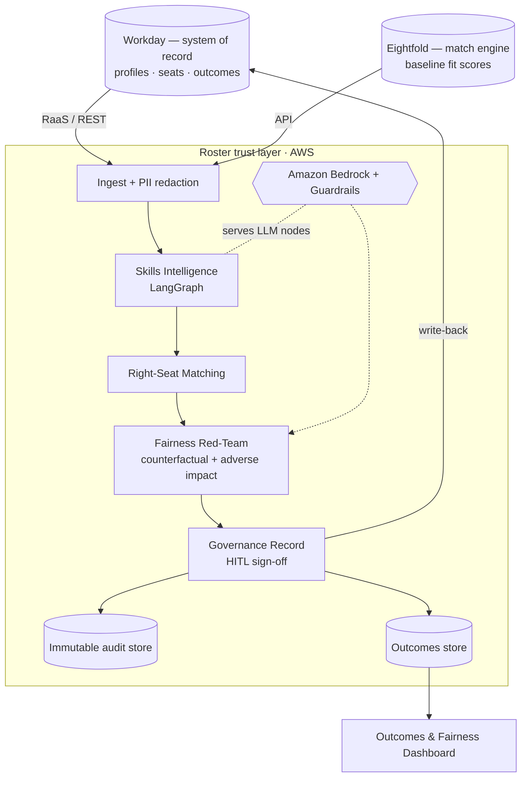

# Roster — Reference Architecture (AWS)

Roster is a trust-and-measurement layer over the talent platforms an org already
owns. The demo runs locally on mock adapters; production targets AWS.

**Security/governance controls:** PII redaction at ingest; Bedrock Guardrails for
prompt-injection/abuse; immutable audit store; human-in-the-loop sign-off;
explainability on every score; synthetic data only in this build.
